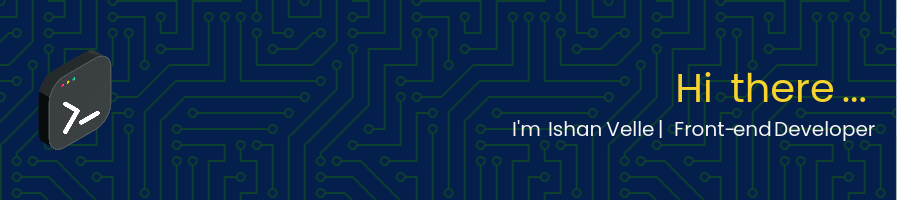

- 🔭 I’m currently working on **JS, React, & DevOps**

- 🌱 I’m currently learning **Python, Go**

- 👯 I’m looking to collaborate on **projects involving Web Devlopment, InfoSec/OSINT, & DevOps**

- 🤝 I’m looking for help with **Python, Go, JS**

- 👨‍💻 All of my projects are available at [#latestprojects](https://yourishanvelle.dev/#projects)

- 💬 Ask me about **Web development, DevOps, Cybersecurity/Infosec/OSINT/DFIR, Homelabs**

- ⚡ Fun fact **Everything's kinda woozy!**

<h3 align="left">Languages and Tools:</h3>

  

&nbsp;

